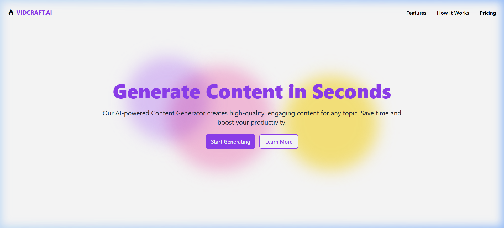
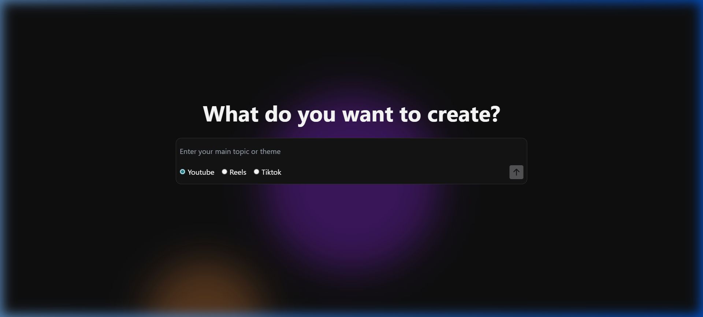

# VidCraft AI 🎬✨


VidCraft AI is a powerful, AI-driven content generation tool designed for creators, marketers, and social media enthusiasts. It leverages cutting-edge AI models to generate high-quality video scripts, SEO-optimized descriptions, and stunning AI-generated thumbnails with just a single topic.

## 🚀 Features

- **Multi-Platform Support**: Generate content tailored for YouTube, Reels, and TikTok.
- **AI Script Generation**: Powered by **Google Gemini 1.5 Flash** for creative and engaging scripts.
- **AI Thumbnail Generation**: High-fidelity images generated using **Hugging Face's FLUX.1-dev** model.
- **SEO Optimization**: Automatically includes trending tags and optimized descriptions.
- **Modern UI**: A sleek, dark-themed dashboard built with React and Tailwind CSS.
- **Responsive Design**: Seamless experience across all devices.

## 📸 Screenshots

| Landing Page | Main Application |
| :---: | :---: |
|  |  |

## 🛠️ Tech Stack

- **Frontend**: React.js, Vite, Tailwind CSS, Lucide React
- **Backend**: Node.js, Express.js
- **AI Models**: 
  - **Text**: Google Gemini 1.5 Flash
  - **Images**: Hugging Face FLUX.1-dev
- **Deployment**: Vercel

## 📦 Installation & Setup

### 1. Clone the Repository
```bash
git clone https://github.com/aditya29625/vidcraft-video-automation-tool.git
cd vidcraft
```

### 2. Backend Setup
1. Navigate to the backend directory:
   ```bash
   cd backend
   ```
2. Install dependencies:
   ```bash
   npm install
   ```
3. Create a `.env` file and add your API keys:
   ```env
   PORT=3000
   GOOGLE_API_KEY=your_gemini_api_key
   HF_API_KEY=your_hugging_face_api_key
   ```

### 3. Frontend Setup
1. Navigate to the frontend directory:
   ```bash
   cd ../frontend
   ```
2. Install dependencies:
   ```bash
   npm install
   ```
3. Create a `.env` file and set the backend URL:
   ```env
   VITE_BACKEND_URL=http://localhost:3000
   ```

## 🚀 Running the Application

### Start the Backend
```bash
cd backend
npm run dev
```

### Start the Frontend
```bash
cd frontend
npm run dev
```

Visit `http://localhost:5173` to start crafting!

## 📂 Project Structure

```text
vidcraft/
├── backend/          # Express.js server & AI integration
│   ├── routes/       # API endpoints (Gemini, FLUX)
│   └── .env          # Backend environment variables
├── frontend/         # React + Vite application
│   ├── src/          # React components & pages
│   └── public/       # Static assets (Banner, Icons)
└── README.md         # Project documentation
```

## 📝 Usage

1. Enter your video topic or theme in the main input bar.
2. Select the platform (YouTube, Reels, or TikTok).
3. Click the generate button.
4. Review your AI-generated script, description, tags, and thumbnail!

## 🤝 Contributing

Contributions are welcome! Please feel free to submit a Pull Request.

## 📄 License

This project is licensed under the ISC License.

---
Built with ❤️ by [Aditya](https://github.com/aditya29625)
